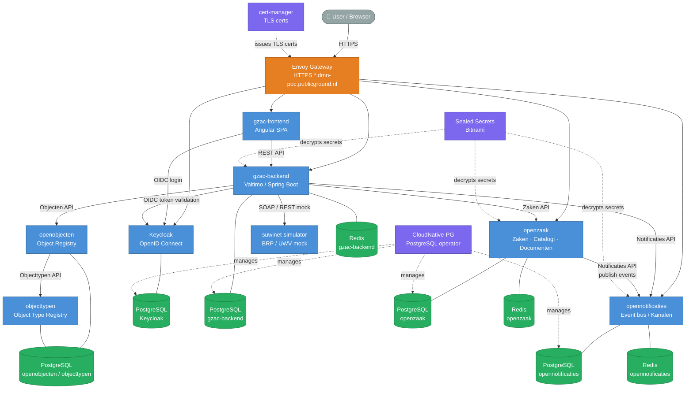

# poc-gzac

GitOps repository for the **GZAC (Generiek Zaak Afhandelcomponent)** Proof of Concept stack, managed with [Argo CD](https://argo-cd.readthedocs.io/) on Kubernetes.

---

## Table of Contents

- [Overview](#overview)
- [Architecture](#architecture)
- [Environments](#environments)
- [Stack Components](#stack-components)
- [Prerequisites](#prerequisites)
- [Quick Start — Local](#quick-start--local)
- [Quick Start — 655-dmn-poc (AKS)](#quick-start--655-dmn-poc-aks)
- [Secret Management](#secret-management)
- [Test Scripts](#test-scripts)
- [Contributing](CONTRIBUTING.md)

---

## Overview

This repository defines the full GitOps configuration for a GZAC case-management stack aligned with the Dutch [VNG ZGW API standards](https://vng-realisatie.github.io/gemma-zaken/). It is structured as an Argo CD multi-environment mono-repo containing:

- **Application Helm values** and additional Kubernetes manifests per environment
- **Infrastructure Helm values** (operators, TLS, storage, secrets)
- **Argo CD ApplicationSets** that wire everything together
- **Test and utility scripts** for integration testing and operations

The stack runs on two clusters:

| Environment | Cluster | Domain | Registry |
|---|---|---|---|
| `local` | Kind (`gitops-argocd`) | `*.wigo4it.nl` | Docker Hub |
| `655-dmn-poc` | AKS (`aks-655-dmn-poc`) | `*.dmn-poc.publicground.nl` | `acr655.azurecr.io` |

---

## Architecture

The diagram below shows the integration relationships between all stack components.



### Authentication flow

```
Browser → Keycloak (OIDC) → JWT → gzac-backend
                                 → gzac-frontend
```

### ZGW event flow

```
gzac-backend → POST /zaken → openzaak
openzaak     → POST notification → opennotificaties
opennotificaties → push to abonnees (gzac-backend, etc.)
```

---

## Environments

### `local`

A [Kind](https://kind.sigs.k8s.io/) cluster for local development.

| Property | Value |
|---|---|
| Cluster name | `gitops-argocd` |
| Domain | `*.wigo4it.nl` |
| TLS | ❌ HTTP only |
| Container registry | Docker Hub |
| Sealed Secrets Web UI | ✅ enabled |

**Enabled apps**: openzaak, opennotificaties, keycloak  
**Disabled**: gzac-backend, gzac-frontend, openobjecten, objecttypen, suwinet-simulator, cert-manager

### `655-dmn-poc`

An Azure Kubernetes Service (AKS) cluster for the DMN proof of concept.

| Property | Value |
|---|---|
| Cluster name | `aks-655-dmn-poc` |
| Domain | `*.dmn-poc.publicground.nl` |
| TLS | ✅ cert-manager (Let's Encrypt) |
| Container registry | `acr655.azurecr.io` |
| Sealed Secrets Web UI | ❌ disabled |

**Enabled apps**: gzac-backend, gzac-frontend, openzaak, opennotificaties, keycloak, openobjecten, objecttypen, suwinet-simulator

---

## Stack Components

### Applications

| Component | Chart | Version | Description |
|---|---|---|---|
| `gzac-backend` | `gzac-backend` | 4.2.2 | Valtimo/Spring Boot case engine |
| `gzac-frontend` | `gzac-frontend` | 0.1.18 | Angular case management UI |
| `openzaak` | `openzaak` | 1.13.1 | VNG ZGW: Zaken, Catalogi, Documenten APIs |
| `opennotificaties` | `opennotificaties` | 1.13.1 | VNG ZGW: event notification hub |
| `openformulieren` | `openforms` | 1.12.0 | Form builder (disabled) |
| `openobjecten` | `objecten` | 2.12.0 | Generic object registry |
| `objecttypen` | `objecttypen` | 1.6.1 | Object type schema registry |
| `suwinet-simulator` | `generic` | 0.0.30 | SuwiNet (BRP/UWV) mock service |
| `keycloak` | Operator CR | — | OIDC/SAML2 identity provider |

### Infrastructure

| Component | Chart | Version | Description |
|---|---|---|---|
| `cpng` | `cloudnative-pg` | 0.22.1 | PostgreSQL operator |
| `redis` | `redis-operator` | 0.24.0 | Redis cluster operator |
| `keycloak-operator` | `keycloak-operator` | 1.0.x | Keycloak K8s operator |
| `sealed-secrets` | `sealed-secrets` | 2.17.9 | GitOps-safe secret encryption |
| `sealed-secrets-web` | `sealed-secrets-web` | 3.3.0 | Browser UI for sealing secrets (local only) |
| `cert-manager` | `cert-manager` | 1.20.1 | TLS certificate provisioning |
| `envoy-gateway` | Kustomize | — | L7 HTTPS gateway |
| `gateway-api` | Kustomize | — | Kubernetes Gateway API CRDs |
| `storage-classes` | Kustomize | — | `managed-csi-retain` storage class |

---

## Prerequisites

| Tool | Version | Install |
|---|---|---|
| `kubectl` | ≥ 1.28 | https://kubernetes.io/docs/tasks/tools/ |
| `helm` | ≥ 3.14 | https://helm.sh/docs/intro/install/ |
| `argocd` CLI | ≥ 2.x | https://argo-cd.readthedocs.io/en/stable/cli_installation/ |
| `kubeseal` | 0.32.x | https://github.com/bitnami-labs/sealed-secrets#installation |
| `task` | ≥ 3.x | https://taskfile.dev/installation/ |
| `kind` | 1.32.0 (local only) | https://kind.sigs.k8s.io/docs/user/quick-start/ |

---

## Quick Start — Local

```bash
# 1. Clone the repo
git clone https://github.com/publicground/poc-gzac.git
cd poc-gzac

# 2. Check all required tools are installed
task requirements-check

# 3. Create Kind cluster, install Argo CD, and deploy the full stack
task run-local

# 4. Get Argo CD credentials
task fetch-argocd-creds
```

The local Argo CD UI is available at `http://localhost:8080` after port-forwarding, or via `task expose-lb`.

Default admin credentials after cluster bootstrap:
- **openzaak / opennotificaties**: `admin` / see sealed secret in cluster

---

## Quick Start — 655-dmn-poc (AKS)

```bash
# Switch context
kubectl config use-context aks-655-dmn-poc

# Interact with Argo CD (core mode — no server login required)
export ARGOCD_OPTS="--core"

# Check app health
argocd app list

# Sync a specific app
argocd app sync argocd/<app-name>
```

---

## Secret Management

Secrets are stored in git as **SealedSecrets** (encrypted with the cluster's public key). They are only decryptable by the `sealed-secrets` controller running in the target cluster.

### Sealing a new secret (655-dmn-poc)

```bash
# Ensure correct kubectl context
kubectl config use-context aks-655-dmn-poc

# Seal a literal secret
echo -n "mysecretvalue" | kubeseal --raw \
  --from-file=/dev/stdin \
  --namespace publicground \
  --name my-secret \
  --controller-namespace sealed-secrets \
  --controller-name sealed-secrets
```

Sealed secret files live in `apps/<app>/additionalmanifests/<env>/`.

### Local environment

Use the **Sealed Secrets Web UI** available at `http://sealed-secrets-web.wigo4it.nl` when running locally.

---

## Test Scripts

Scripts live in `test/scripts/`.

### `publish-catalogus.sh`

Publishes all concept resources (informatieobjecttypen → besluittypen → zaaktypen) in OpenZaak via the catalogi API. Run this after importing a catalogus ZIP via the admin UI.

```bash
CLIENT_SECRET=<gzac-client-secret> ./test/scripts/publish-catalogus.sh
```

### `test-create-zaak.sh`

End-to-end integration test: creates a zaak in OpenZaak and checks that a notification appears in OpenNotificaties.

```bash
# Run interactively (will prompt for CLIENT_SECRET)
./test/scripts/test-create-zaak.sh

# Or pass secret via environment variable
CLIENT_SECRET=<gzac-client-secret> ./test/scripts/test-create-zaak.sh

# Pass a specific zaaktype UUID
CLIENT_SECRET=<secret> ./test/scripts/test-create-zaak.sh <zaaktype-uuid>
```

> **Note**: A published zaaktype must exist in OpenZaak before running this script. Use `publish-catalogus.sh` first.

---

## Repository Structure

```
.
├── apps/                        # Application Helm values + extra K8s manifests
│   ├── <app>/
│   │   ├── values.yaml          # Base values (all environments)
│   │   ├── values.local.yaml    # Local overrides
│   │   ├── values.655-dmn-poc.yaml
│   │   └── additionalmanifests/
│   │       ├── local/           # HTTPRoutes, SealedSecrets, CNPG clusters
│   │       └── 655-dmn-poc/
├── appsets/                     # Argo CD ApplicationSets
│   ├── local/
│   └── 655-dmn-poc/
├── infrastructure/              # Infrastructure Helm values + overlays
│   └── <component>/
│       ├── values.yaml
│       ├── values.local.yaml
│       ├── values.655-dmn-poc.yaml
│       └── overlays/            # Kustomize overlays (where applicable)
├── test/
│   ├── local/                   # Argo CD bootstrap manifests for local cluster
│   └── scripts/                 # Integration test and ops scripts
└── Taskfile.yaml                # Task automation (local cluster lifecycle)
```
